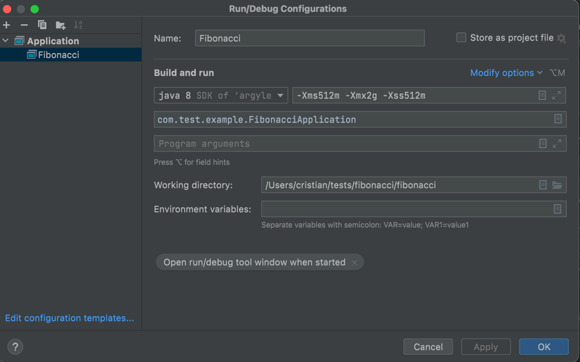

Fibonacci Test.

This springboot application was developed with  Intellij Community Edition.
The project structure if the one recommended in [Spring docs](https://docs.spring.io/spring-boot/docs/current/reference/html/using.html#using.structuring-your-code).
To execute this service locally, you need access to build and run either via
 maven executing: 
```
mvn clean
mvn install
mvn spring-boot:run
```
or via Intellij using the Run/Debug configuration included as png. 



There is swagger information via:
```
http://localhost:8080/v3/api-docs
localhost:8080/swagger-ui/index.html?configUrl=/v3/api-docs/swagger-config#/
```

In root folder of the project there is also a postman collection to use with the respective tool, file
```
Fibonacci.postman_collection.json
```
To build the docker image:
```
docker build -t spring-fibonacci-test .
```
and to run the image 
```
docker run -p 8080:8080 -t spring-fibonacci-test
```
For K8s use ```fib.yaml``` file and deploy it on the local k8s (tested on macos) with command 

```kubectl apply -f fib.yaml```

Check that the pod is launched correctly with commands:

```
kubectl get pods -A
kubectl logs pod_name
kubectl describe pod pod_name
```

One should see after executing first command from above a line like bellow:

```
NAMESPACE       NAME                                READY   STATUS    RESTARTS   AGE
default         fibonacci-67b47f4d96-r5c5h          1/1     Running   0          3m8s
```

To connect to the pod, one option is to execute a port forwarding with command

```
kubectl port-forward  -n default fibonacci-67b47f4d96-r5c5h  8080:8080
```
Now browser and/or postman invocations should work.